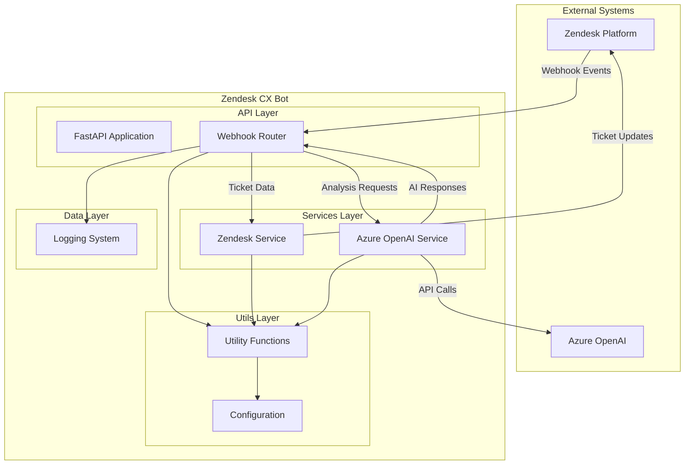
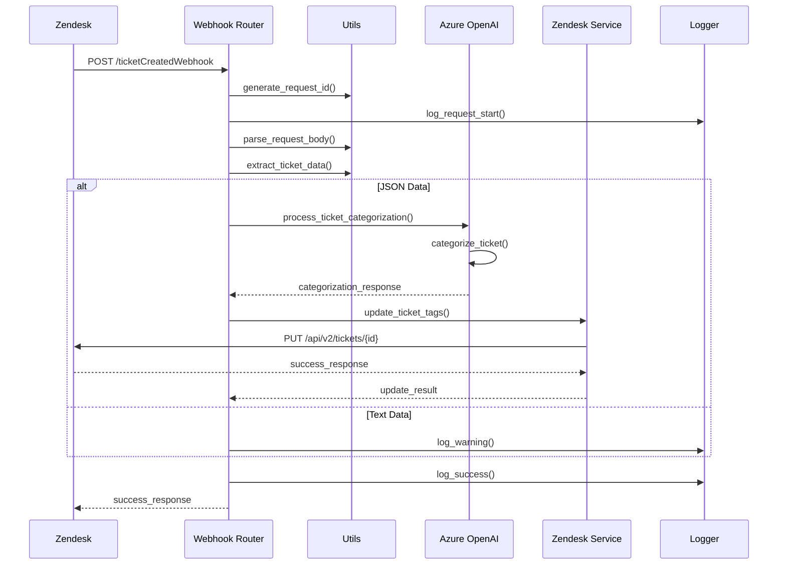
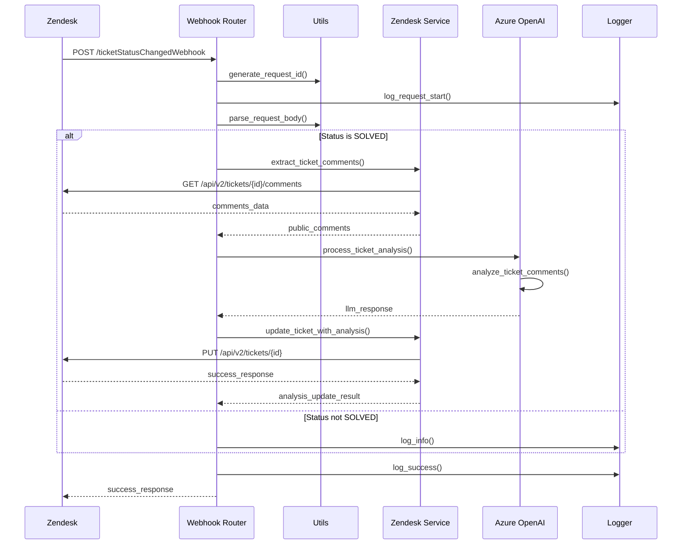
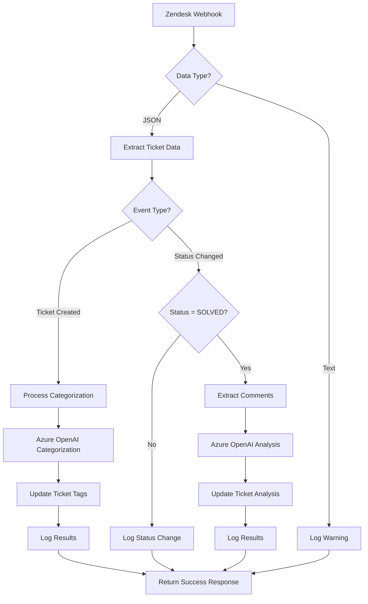
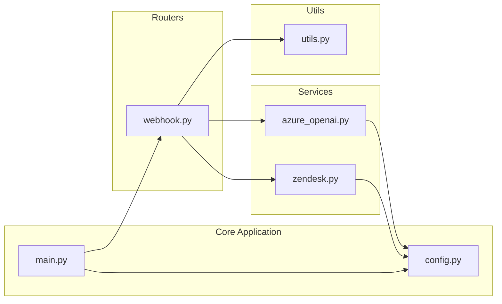
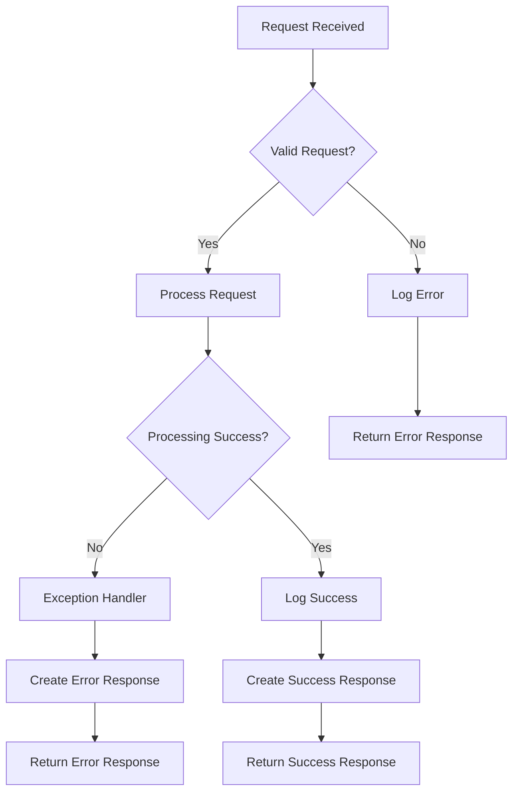
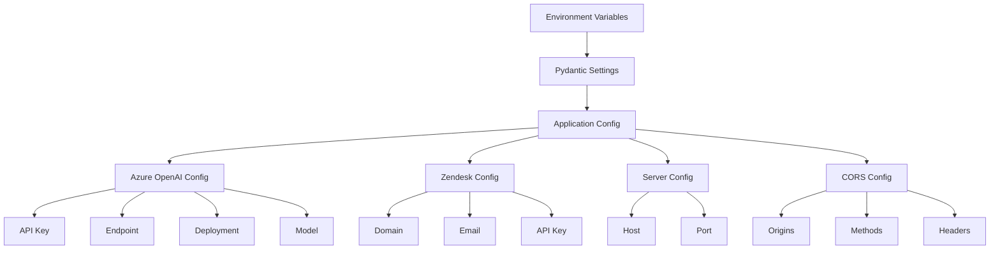
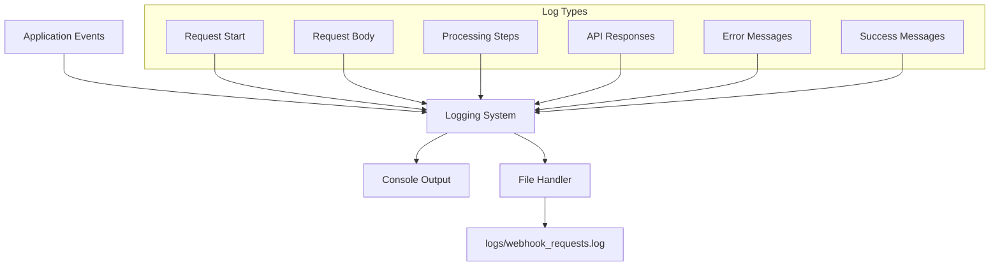
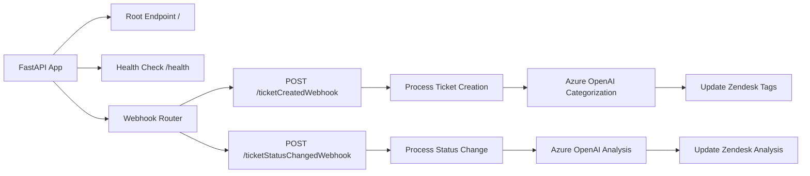
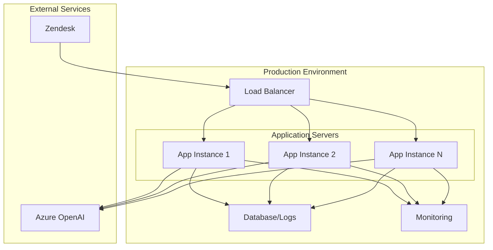

# Zendesk CX Bot - Mermaid Charts

## 1. System Architecture Overview

## 2. Ticket Creation Flow

## 3. Ticket Status Change Flow

## 4. Data Flow Diagram

## 5. Component Relationships

## 6. Error Handling Flow

## 7. Configuration Management

## 8. Logging Architecture

## 9. API Endpoints Structure

## 10. Deployment Architecture

